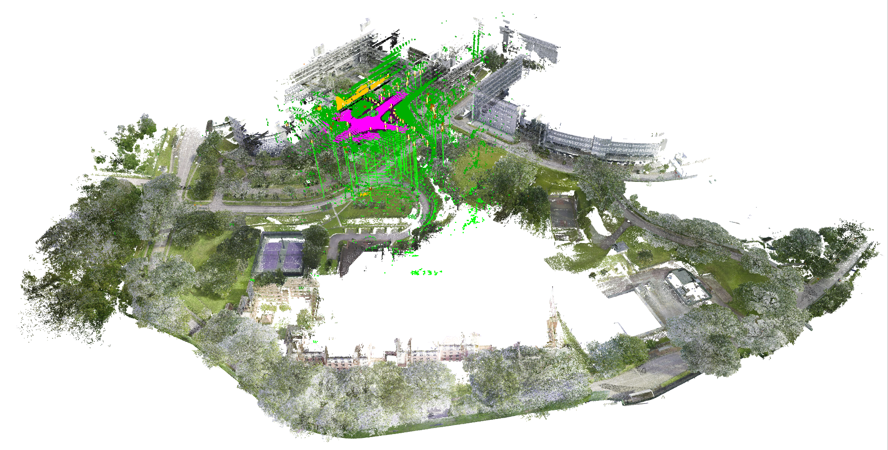

<p align="center">

  <h1 align="center">Outram: One-shot Global Localization via Triangulated Scene Graph and Global Outlier Pruning</h1>

  <!-- <p align="center">
    <a href="https://github.com/PRBonn/PIN_SLAM#run-pin-slam"></a>
    <a href="https://github.com/PRBonn/PIN_SLAM#installation"></a>
    <a href="https://arxiv.org/pdf/2309.08914.pdf">.svg?style=flat-square" /></a>
    <a href="https://lbesson.mit-license.org/"></a>
  </p> -->
  
  <p align="center">
    <strong>Pengyu Yin</strong>
    ·
    <strong>Haozhi Cao</strong>
    ·
    <strong>Thien-Minh Nguyen</strong>
    ·
    <strong>Shenghai Yuan</strong>
    ·
    <strong>Shuyang Zhang</strong>
    ·
    <strong>Kangcheng Liu</strong>
    ·
    <strong>Lihua Xie</strong>
    
  </p>
  <h5 align="center"><a href = "https://www.ntu.edu.sg/cartin"><strong>Centre for Advanced Robotics Technology Innovation (CARTIN), Nanyang Technological University</strong></a></h5>
  <h3 align="center"><a href="https://arxiv.org/pdf/2309.08914.pdf">Arxiv</a></h3>
  <div align="center"></div>
</p>

**TL;DR. One-shot LiDAR global localization leveraging substructures of 3D scene graphs.**

**Please check out our newly published [MCD data set](https://mcdviral.github.io/). Precisely annotated point-wise semantic labels for free. :)**



*One single LiDAR frame (which is different from accumulative counterparts e.g., mcl-based methods) achieved precise global localization (or pose initialization) by searching on a 3D scene graph.*

---


*Running example of Outram on [MCD](https://mcdviral.github.io/) and [MulRan](https://sites.google.com/view/mulran-pr/dataset) against sota LCD (loop closure detection)-based method.* 

---

## Install

### Platform requirement
* Ubuntu OS (tested on 20.04)

### Dependencies

#### 1. Eigen, CMake and Boost
```
sudo apt install cmake libeigen3-dev libboost-all-dev
```

#### 2. Ceres-solver
Please follow the official instruction [here](http://ceres-solver.org/installation.html). Please be informed a version higher than [2.1.0](https://github.com/ceres-solver/ceres-solver/releases/tag/2.1.0) is required.

### Build Outram
We rely on [catkin_tool](https://catkin-tools.readthedocs.io/en/latest/) to build Outram. One can also choose [catkin_make](https://wiki.ros.org/catkin/commands/catkin_make) to build the workspace.
```
mkdir -p ~/catkin_ws/src
cd ~/catkin_ws/src
git clone git@github.com:Pamphlett/Outram.git
cd Outram && mkdir build && cd build
cmake ..
mv pmc-src/ ../../../build/
cd ~/catkin_ws
catkin build outram
``` 

### Data preparation
A few inputs are required to make Outram to work:
* LiDAR scans
* Corresponding point-wise semantic label
* Semantic cluster map (centroids and covariance matrices)
* GT pose file (optional)
* Global point cloud map (optional)

We've prepared one sequence (ntu_night_13) of data out of the [MCD](https://mcdviral.github.io/) data set for testing. Use [this link](https://drive.google.com/file/d/1lDZZvgV0ZGQkLYVSw7MfgM2eFwg_ico-/view?usp=drive_link) to download. Unzip the file and put them into the ```test_data``` subfolder. 

An example of the anticipated data set structure is shown here:

```
📦test_data
 ┣ 📂bin
 ┃ ┣ 📜frame000000.bin
 ┃ ┣ 📜frame000001.bin
 ┃ ┗ 📜...
 ┣ 📂label
 ┃ ┣ 📜frame000000.bin
 ┃ ┣ 📜frame000001.bin
 ┃ ┗ 📜...
 ┣ 📂semantic_cluster_map
 ┃ ┣ 📜cluster_map.pcd
 ┃ ┗ 📜covariances.bin
 ┣ 📜bin_filelist.txt
 ┣ 📜label_filelist.txt
 ┣ 📜GlobalFullMapSpar.pcd
 ┗ 📜pose.txt
```

### Run Outram

#### Sample data set

In the catkin workspace, run the following lines to test on the provided data:
```
source devel/setup.bash
roslaunch outram global_localization.launch
```

#### Other/self-collected data set

## Abstract

<details>
  <summary>[Abstract (click to expand)]</summary>
One-shot LiDAR localization refers to the ability to estimate the robot pose from one single point cloud, which yields significant advantages in initialization and relocalization processes. 
In the point cloud domain, the topic has been extensively studied as a global descriptor retrieval (i.e., loop closure detection) and pose refinement (i.e., point cloud registration) problem both in isolation or combined. However, few have explicitly considered the relationship between candidate retrieval and correspondence generation in pose estimation, leaving them brittle to substructure ambiguities. 
To this end, we propose a hierarchical one-shot localization algorithm called Outram that leverages substructures of 3D scene graphs for locally consistent correspondence searching and global substructure-wise outlier pruning. Such a hierarchical process couples the feature retrieval and the correspondence extraction to resolve the substructure ambiguities by conducting a local-to-global consistency refinement. We demonstrate the capability of Outram in a variety of scenarios in multiple large-scale outdoor datasets.
</details>

## Contact
If you have any question, please contact:

- Pengyu Yin {[pengyu001@e.ntu.edu.sg]()}

## Acknowledgment

## Citation
If you find Outram useful, please consider citing:
```
@article{yin2023outram,
  title={Outram: One-shot Global Localization via Triangulated Scene Graph and Global Outlier Pruning},
  author={Yin, Pengyu and Cao, Haozhi and Nguyen, Thien-Minh and Yuan, Shenghai and Zhang, Shuyang and Liu, Kangcheng and Xie, Lihua},
  journal={arXiv preprint arXiv:2309.08914},
  year={2023}
}
```

## Misc
[Outram](https://en.wikipedia.org/wiki/Outram_Park_MRT_station) stems from one of the MRT (subway) station name in Singapore.